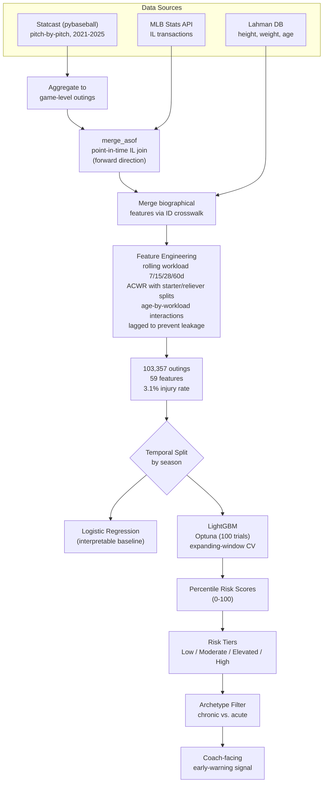

# Pitcher Arm-Injury Early-Warning System

**Game-by-game arm-injury risk modeling for MLB pitchers, 2021-2025.**

This system estimates how likely a pitcher is to land on the injured list with an arm injury inside 14 days of a given outing. It then turns that estimate into a risk signal a coach can read at a glance, instead of leaving a bare probability sitting on the table.

<p>
  
  
  
  
  
  
</p>

---

> ### TL;DR
> - **Problem.** Arm injuries are sidelining elite pitchers earlier and more often, at enormous cost to clubs and the league. Most published tools predict injury across a full season. Very little work tries to do it at the level of a single outing.
> - **Approach.** I built a dataset of 103,357 individual pitching outings (1,602 pitchers across five seasons) from three public sources, engineered leakage-safe workload features, and benchmarked a regularized logistic regression against a tuned LightGBM classifier on a strict season-based temporal split.
> - **Result, stated plainly.** Injury prediction at the game level, over a two-week window, is hard. Raw model lift over the 2.85% base injury rate sits around 1.3x. The real payoff comes after the model runs, when those probabilities get binned into percentile risk tiers and a stubborn player-type signal gets pulled apart from true acute risk. That last step lifts the actionable high-risk tier to 3.06x the base rate.


---

## Table of Contents
1. [The Problem](#1-the-problem)
2. [What Makes This Hard](#2-what-makes-this-hard)
3. [System Overview](#3-system-overview)
4. [The Data](#4-the-data)
5. [Feature Engineering](#5-feature-engineering)
6. [Modeling Methodology](#6-modeling-methodology)
7. [Results](#7-results)
8. [From Probabilities to Decisions: Risk Tiers](#8-from-probabilities-to-decisions-risk-tiers)
9. [The Archetype Insight](#9-the-archetype-insight)
10. [What the Data Says](#10-what-the-data-says)
11. [Model Interpretability (SHAP)](#11-model-interpretability-shap)
12. [Recommendations for Pitching Staffs](#12-recommendations-for-pitching-staffs)
13. [Limitations](#13-limitations)
14. [Future Directions](#14-future-directions)
15. [Tech Stack](#15-tech-stack)
16. [Repository Structure](#16-repository-structure)
17. [Reproducing the Pipeline](#17-reproducing-the-pipeline)
18. [About the Author](#18-about-the-author)

---

## 1. The Problem

Pitchers at every level are getting hurt earlier in their careers and more often than they used to. For clubs that pour money into front-of-rotation starters and back-of-bullpen relievers, the exposure is brutal.

Two recent cases make the point. Gerrit Cole threw zero pitches in 2025 after Tommy John surgery, and the Yankees still carried his $36M salary. Shohei Ohtani signed the largest contract in baseball history in large part because he can pitch and hit, then did not throw a single inning in 2024 following a torn UCL.

The damage runs past any one roster. A league that keeps losing its best arms for months loses competitive quality, and fan interest tends to follow. In December 2024 MLB commissioned a study on the trend. It put most of the blame on rising velocity, and it pointed as well to pitchers chasing more break and to a culture of year-round max-effort throwing.

So here is the opening. A pitching staff that gets warned when a scheduled pitcher carries elevated short-term risk, and might need rest or a closer look, has something worth having. This project is a proof of concept for that warning.

---

## 2. What Makes This Hard

Most published pitcher-injury research works on a long horizon. A typical setup feeds a pitcher's full 2024 season into a model that predicts whether he gets hurt in 2025. As far as I can find, nobody has published an outing-level, short-term version of the problem like the one here.

That ambition runs into a handful of structural problems, laid out below.

| Challenge | Why it bites | The response in this project |
|---|---|---|
| **Severe class imbalance** | Only 3.1% of outings precede an arm injury inside 14 days | PR-AUC as the headline metric, class weighting, and an F0.5-tuned threshold that prices in asymmetric cost |
| **Temporal leakage** | Rolling and cumulative features can quietly peek at the future | Every window uses `closed='left'`, and cumulative or prior-outing features are lagged with `.shift(1)` |
| **Three messy sources** | Statcast, IL transactions, and biographical data arrive in different schemas | A point-in-time `merge_asof` join plus an ID-crosswalk reconciliation |
| **A possible signal ceiling** | One outing may say very little about an injury weeks out | Honest evaluation on a true temporal hold-out, with no inflation of the numbers |

The whole thing is a deliberately rigorous swing at a problem that may sit close to the ceiling of what game-level data can support. The README does not pretend otherwise.

---

## 3. System Overview



---

## 4. The Data

The modeling table joins three independent public sources into one row per pitching outing.

| Source | Accessed via | Contributes |
|---|---|---|
| **Statcast** | `pybaseball` | Pitch-level performance: velocity, spin, release point, extension, movement, pitch mix |
| **Injured List transactions** | `MLB-StatsAPI` | IL placements, parsed for arm-specific injury descriptions |
| **Lahman Baseball Database** | Kaggle CSV | Biographical context: height, weight, birth year (used to derive age) |

### Scale

| | |
|---|---|
| **Outings** | 103,357 |
| **Unique pitchers** | 1,602 |
| **Seasons** | 2021-2025 |
| **Features per outing** | 59 |
| **Injury-positive outings** | 3,205 (**3.10%**) |
| **Injury-negative outings** | 100,152 |

### The Target Variable

`target_inj_14d` equals 1 when a pitcher was placed on the IL with an injury that is specifically arm-related (elbow, shoulder, forearm, biceps, triceps, hand, wrist, finger, or nerve) inside 14 days of the outing. Labeling runs through a forward `merge_asof`, so each outing matches to the next qualifying IL placement, and `days_to_injury` gets computed alongside as a sanity check.

### Descriptive Snapshot

A handful of stats frame the population and double as data checks.

- Median time-to-injury, counting only outings that do precede an injury in the window, is 294 days. That one number explains a lot about why the target is so rare and why so few outings fall inside the 14-day risk band.
- Average fastball velocity: 93.74 MPH.
- Average breaking-ball usage: 44%.
- Average height and weight: 74.56 in and 213 lbs. The tallest pitcher measured 83 in, the heaviest 285 lbs.
- Average 30-day max pitch count: 42.
- Longest single outing in the data: a reckless 131 pitches.

---

## 5. Feature Engineering

Feature design is where baseball knowledge does most of the work. The 59 features fall into five groups.

**1. Per-outing performance.** Pitch count, average fastball velocity, spin rate, release-point coordinates and their within-game spread, extension, movement, and breaking-ball share.

**2. Rolling-window workload.** Pitch-count sums over 7, 15, 28, and 60-day windows, rolling velocity and spin averages, and release-point drift as a candidate fatigue signal.

**3. Acute-to-chronic workload ratios (ACWR).** A workload-management idea borrowed from sports science, computed for pitch count, velocity, and spin. Each ratio gets split into a starter term and a reliever term. The reason is that a given ACWR carries a very different meaning for a starter on a fixed five-day routine than for a reliever whose usage jumps around from week to week.

**4. Biographical context.** Age, height, weight, throwing hand, plus an engineered age-by-28-day-pitch-count term that lets workload tolerance shift with age.

**5. The label.** The `target_inj_14d` flag described above.

### Two Decisions Worth Calling Out

> **Leakage prevention is treated as a first-class concern.** Every rolling window uses `closed='left'`, so the current outing never feeds its own feature. Cumulative-season pitch counts are lagged with `.shift(1)`, and a dedicated helper recomputes the 7, 28, and 60-day workloads exclusive of the current row. This is the most common way an injury model quietly cheats, and it is the first place a careful reviewer will look.

> **Outlier discipline.** The top and bottom 1% of every ACWR feature get clipped. A few extreme ratios, like a reliever's first appearance after a long layoff, would otherwise swamp the linear baseline.

---

## 6. Modeling Methodology

### Temporal Validation, No Shuffling

Random train/test splits leak the future into the past and badly overstate performance on time-series data. The split here runs by season instead.

| Split | Seasons | Outings | Injuries |
|---|---|---|---|
| **Train** | 2021-2023 | 63,047 | 1,981 |
| **Validation** | 2024 | 21,427 | 686 |
| **Test** | 2025 | 18,883 | 538 |

The 2024 set handles threshold tuning and early stopping only. The 2025 season stays untouched until the very end.

### Baseline: Regularized Logistic Regression

Logistic regression earns a spot as the baseline for one reason. Its coefficients are readable, and its score sets a floor that tells you how much a tree model is adding on top. Preprocessing covers one-hot encoding of throwing hand with `drop_first=True` to dodge the dummy-variable trap, median imputation paired with a missingness flag, standard scaling, and `class_weight='balanced'`.

### Primary Model: LightGBM

Injury risk does not move in straight lines. Per-pitch arm stress climbs roughly exponentially as an outing drags on, and age, role, and recent workload interact in ways no analyst can fully write out by hand. Gradient-boosted trees pick up those threshold effects and interactions on their own, and they handle nulls and categoricals without extra plumbing.

A few specifics:

- **Imbalance.** `scale_pos_weight` seeded from the negative-to-positive ratio.
- **Validation.** An expanding-window cross-validation scheme. Train on 2021, validate on 2022, then train on 2021 plus 2022 and validate on 2023, so the model gets rewarded for generalizing forward in time.
- **Tuning.** Optuna, 100 trials, optimizing cross-validated PR-AUC over a space biased toward shallow, well-regularized trees:

  | Hyperparameter | Range |
  |---|---|
  | `learning_rate` | 0.01-0.05 (log) |
  | `num_leaves` | 8-31 |
  | `max_depth` | 3-5 |
  | `min_child_samples` | 100-500 |
  | `scale_pos_weight` | 1.0-3.0 |
  | `subsample` / `colsample_bytree` | 0.6-0.95 / 0.5-0.9 |
  | `reg_alpha` / `reg_lambda` | 0.01-10.0 (log) |
  | `min_split_gain` | 0.0-0.5 |

### Threshold Tuning and Asymmetric Cost

A 0.5 cutoff means nothing on a 3% problem. Thresholds get tuned on the validation precision-recall curve to maximize F0.5, which weights precision twice as heavily as recall. The choice is deliberate.

> Resting a healthy pitcher costs a club far more than letting a healthy pitcher take the mound. A high-precision, lower-recall flag respects that imbalance. The system would rather miss some risk than cry wolf and burn through a coach's trust.

---

## 7. Results

The numbers below come from the 2024 validation and 2025 test sets. With classes this lopsided, PR-AUC is the metric that matters. A random classifier scores about the base rate, near 0.0285 on the test set.

| Model | Validation PR-AUC (2024) | Test PR-AUC (2025) | Test Lift vs. Base Rate |
|---|---|---|---|
| Logistic Regression (baseline) | 0.0405 | 0.0362 | ~1.27x |
| **LightGBM (Optuna-tuned)** | **0.0479** | **0.0370** | **~1.30x** |

Here is the read, without spin. The tuned LightGBM beats the linear baseline and clears the base injury rate by roughly 1.3x, but the absolute performance is modest. I am not going to dress that up. Two things follow.

First, the thin gap between a linear model and a heavily tuned gradient booster says the features hold limited extra non-linear signal at this horizon. Second, this may simply be the ceiling for game-by-game short-term prediction, which is a useful finding in its own right when no prior published work has tried the problem at this resolution.

The more interesting story starts once those probabilities become decisions.

---

## 8. From Probabilities to Decisions: Risk Tiers

No coach acts on a probability of 0.041. So the raw LightGBM probabilities get mapped to a percentile rank against the training distribution. A score of 95 means the outing is riskier than 95% of all training outings. A non-technical staffer can read that instantly.

The percentiles roll up into four tiers, scored on the 2025 hold-out.

| Risk Tier | Percentile | Test Outings | Lift vs. Base Rate |
|---|---|---|---|
| **Low** | below 70th | 13,739 | **0.82x** |
| **Moderate** | 70th-85th | 2,773 | **1.39x** |
| **Elevated** | 85th-95th | 1,699 | **1.65x** |
| **High** *(all outings)* | 95th+ | 672 | 1.36x |
| **High** *(acute only, see Section 9)* | 95th+, filtered | n/a | **3.06x** |

*Base injury rate on the 2025 test set is roughly 2.85%. Lift is each tier's injury rate over that base rate.*

The tiers behave the way you would want almost everywhere. The Low tier covers 80% of all outings and carries below-baseline risk. Moderate and Elevated climb steadily above it. One result breaks the pattern. The raw High tier comes in under Elevated, the band right beneath it. That anomaly is what surfaced the most interesting finding in the project.

---

## 9. The Archetype Insight

The raw High tier, 95th percentile and up, looked disappointing at first. Its lift came in below the Elevated tier sitting just under it. Rather than shrug at the metric, I went back to look at which outings the model was flagging.

The cause was a confusion between a type of player and a type of event. One archetype kept getting flagged in a huge share of its own outings: short, lean, hard-throwing pitchers, lit up almost every time they took the ball. The model had memorized a body type and kept firing on it, which buried the real acute spikes the system is supposed to catch, the sudden workload jumps and velocity cliffs.

The fix was to tell chronic flags apart from acute ones by counting how often each pitcher shows up in the top tier. Any pitcher flagged in the High tier four or more times in a season gets reclassified as an "archetype" signal, useful for long-term load planning. Everyone else stays "acute," meaning a warning worth acting on this week.

This was the cleanest win in the whole study. Filtering archetype flags out of the High tier lifted its performance on real acute outings from 1.36x to 3.06x the base rate. The highest-risk tier finally became the most predictive one, the way it should have been from the start.

> This is the part I am proudest of. What made the difference was reading the model's errors closely enough to notice that "risky pitcher" and "risky outing" are two different questions. A risk system that never tells them apart keeps flagging the same durable flamethrowers, and over time it teaches coaches to stop listening.

---

## 10. What the Data Says

The exploratory work turned up a few patterns that matter for how a staff thinks about workload. The figures come from the analysis scripts. Drop the exported PNGs into `reports/figures/` and they render here.

### Injury Risk by Age


Pitchers between 25 and 31 carry elevated injury rates. Pitchers 32 and older show lower rates, which looks backwards at first glance. Two explanations probably both apply. Older pitchers tend to throw slower and get managed more carefully. On top of that, survivorship is doing some quiet work, since a pitcher who is still in the majors at 33 is, by selection, one of the durable ones who dodged a serious arm injury earlier. The data cannot fully pull those apart, and I would rather flag that than overclaim.

### The Velocity Arms Race


The season-by-season histograms, restricted to outings of 18 or more pitches so tiny relief cameos do not skew the picture, tell a two-part story. The mean fastball creeps up year over year. At the same time, the share of outings averaging 98-plus MPH rises sharply. That is the velocity trend MLB's report ties straight to the injury climb.

### Arm Injuries Over Time


Arm injuries climbed steadily from 2021 through 2024, in line with MLB's findings. The 2021 spike reads best as a COVID artifact. The shortened and partly canceled 2020 season meant some pitchers, including minor leaguers who did not play at all that year, ramped back up in 2021 underconditioned.

---

## 11. Model Interpretability (SHAP)

A risk score that cannot say why it fired is useless to a coach. SHAP, through its TreeExplainer, gives both a global picture and a per-outing breakdown.

The four biggest features by global SHAP value:

1. **Cumulative season pitches** (total accumulated load)
2. **60-day rolling pitch count** (chronic recent load)
3. **3-game innings average** (how deep the recent outings ran)
4. **Game-day fastball velocity** (effort and stuff on the day)


The pipeline also produces per-outing waterfall plots, so any single flagged appearance breaks down into the exact features pushing its risk up or down. That turns an abstract score into something a pitching coach and an analyst can sit down and talk through.


---

## 12. Recommendations for Pitching Staffs

The analysis points to a few pieces of concrete guidance.

1. **Watch the archetype.** Give extra attention to the workloads of shorter, leaner, hard-throwing pitchers. That is the profile the model flags most stubbornly.
2. **Mind the relievers.** Relievers run elevated risk, most likely off their irregular usage. A heavily used arm in the bullpen deserves a closer eye than its raw inning count would suggest.
3. **Track the deviations.** Watch how far a pitcher drifts from his own baselines in velocity, release point, and workload. The raw league-wide numbers matter less than a pitcher's personal departures from them.
4. **Treat a flag as a reason to dig in.** A flag should kick off a real review rather than an automatic benching. A velocity dip can mean injury. It can also mean mechanical drift, a rough night of sleep, or something in between. There are no absolutes in injury prediction, just a messy overlap of biology, mechanics, and everything else happening in a player's life that a model never fully sees.

---

## 13. Limitations

I would rather be upfront about where this model falls short than let a reader find out the hard way. The real limits:

- **Modest predictive power.** Absolute PR-AUC is low, and model-level lift over baseline is small. The tier system and the archetype filter add real operational value, but the output stays a directional signal, well short of a diagnostic.
- **The archetype threshold needs out-of-sample proof.** The "four or more flags" rule is a reasonable heuristic, but its exact cutoff should be confirmed on a future season before anyone leans on it, to rule out the chance that it got quietly fit to the 2025 hold-out.
- **Labels track reported injuries, not onset.** IL placement dates are administrative and trail the underlying physiology. A 14-day window around the placement is a stand-in for a biological process the data never directly observes.
- **No biomechanical or medical inputs.** The model sees performance and workload, not motion capture, force plates, or clinical data. The variables most predictive of arm injury are mostly invisible to it.
- **Selection effects shape the pool.** Only MLB pitchers ever enter the data, and only the ones healthy enough to keep appearing. The age curve above is one visible symptom of that.

---

## 14. Future Directions

- **Add biomechanics.** Joint-kinematics or force-plate data would almost certainly move performance more than any modeling change could.
- **Validate the archetype rule forward** on 2026 data, and look at a continuous chronic-versus-acute score in place of a hard count.
- **Move to survival modeling** (Cox or discrete-time hazards) to predict when an injury hits, in place of a yes-or-no inside 14 days.
- **Bring in pitch-mix and sequencing features** like breaking-ball usage trends and per-pitch stress, both of which MLB's report implicates.
- **Calibrate, then add a cost-explicit decision layer** that lets a club tune the precision-recall tradeoff to its own appetite for resting healthy arms.
- **Personalize per pitcher** so deviations get scored against each arm's own history. That is recommendation three made real.

---

## 15. Tech Stack

| Category | Tools |
|---|---|
| **Language** | Python 3.10+ |
| **Data acquisition** | `pybaseball` (Statcast), `MLB-StatsAPI` (IL transactions), Lahman DB |
| **Wrangling** | `pandas`, `numpy` |
| **Modeling** | `scikit-learn` (logistic regression, metrics, preprocessing), `lightgbm` |
| **Tuning** | `optuna` (TPE sampler, multivariate) |
| **Explainability** | `shap` |
| **Visualization** | `plotnine` (ggplot-style EDA), `matplotlib` |

---

## 16. Repository Structure

```
pitcher-injury-early-warning/
├── README.md
├── requirements.txt
├── src/
│   ├── 01_build_dataset.py      # Statcast + Stats API + Lahman to game-level outings
│   └── 02_train_evaluate.py     # feature eng, LogReg baseline, LightGBM, tiers, SHAP
├── data/
│   ├── raw/                     # cached source pulls (gitignored)
│   └── processed/
│       ├── final_gl_df.csv             # joined game-level dataset
│       └── SportPerformanceDataset.csv # modeling-ready table
├── reports/
│   ├── final_report.pdf         # full written report
│   └── figures/
│       ├── age_density.png
│       ├── velocity_histograms.png
│       ├── injuries_by_season.png
│       ├── shap_summary.png
│       └── shap_waterfall_example.png
└── .gitignore
```

---

## 17. Reproducing the Pipeline

> **A note on data pulls.** Statcast requests are rate-limited, so the acquisition script pulls month by month with `time.sleep()` pauses to keep the API from timing out. A full historical pull takes a while. The cached CSVs under `data/processed/` let you jump straight to modeling.

```bash
# 1. Environment
python -m venv .venv && source .venv/bin/activate
pip install -r requirements.txt

# 2. Build the dataset (slow, pulls and joins all three sources)
python src/01_build_dataset.py

# 3. Train, evaluate, score, and explain
python src/02_train_evaluate.py
```

**`requirements.txt`**
```
pandas
numpy
pybaseball
MLB-StatsAPI
scikit-learn
lightgbm
optuna
shap
plotnine
matplotlib
```

---

## 18. About the Author

Built by **Tommy Gillan**. I hold an M.S. in Business Analytics with a Sports Analytics concentration from the University of Notre Dame, and I come at baseball from a lot of angles. I have played it, umpired it, coached it, and written about it, with earlier work in sports media.

This project lives right where I want to work. Rigorous data engineering and modeling on one side, plain communication to the people who make the calls on the other. The modeling is only half the job. The rest is translation, and it is the part a lot of analytics shops underrate. A probability has to become a risk tier a coach will trust before he sits a starter. The SHAP output has to read like a conversation instead of a wall of colored bars. And the model's blind spots have to be the kind of thing a staff can plan around ahead of time.

*Connect:* [LinkedIn](https://www.linkedin.com/in/tommy-gillan/) · [Email](thomasgillan63@gmail.com) · [Portfolio](https://github.com/tgillz63)

---

<sub>Data sourced from public Statcast, MLB Stats API, and Lahman datasets. This is an independent research project with no affiliation to Major League Baseball or any club.</sub>
